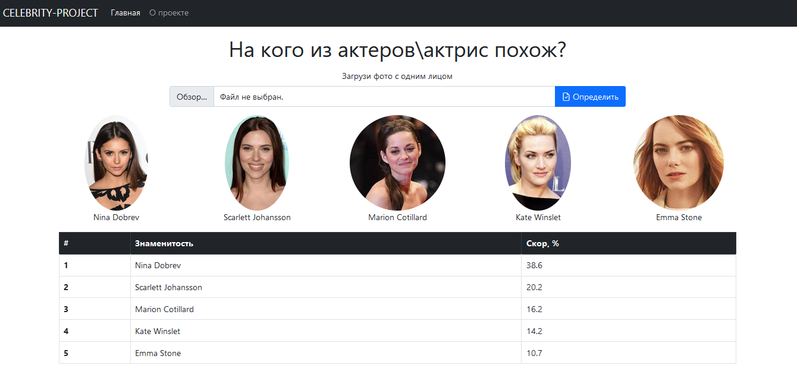

# CelebrityClassification

Данный веб-сервис позволяет определить на кого из кинозвезд по лицу похож человек. После загрузки фотографии предобученная модель выводит топ 5 самых лучших вариантов с нормализованными значениями точности по полученным актерам\актрисам.

## Реализация

+ Для составления датасета была использована библиотека Selenium, при помощи которой через поисковик Google осуществлялся автоматический поиск и скачивание картинок.
+ Далее каждая картинка была представлена в виде 128-размерного вектора чисел с помощью библиотеки face_recognition.
+ На полученных данных был обучен catboost классификатор. На тестовых данных метрика F1-score = 0.87.
+ Серверная часть реализована на Flask. Для фронта был использован Bootstrap.

