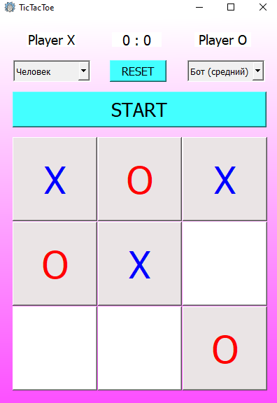
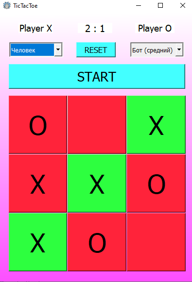
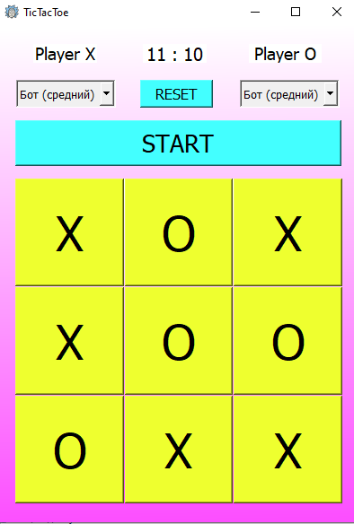

# Tic-Tac-Toe
Игра крестики нолики создана при помощи библиотеки [PyQt5](https://www.riverbankcomputing.com/static/Docs/PyQt5/). Графический интерфейс постороен при помощи **Qt Designer**
В качестве базового кода был взят проект с курса [JetBrains](https://www.jetbrains.com/ru-ru/academy/)

Особенности игры:
+ В игре присутсвует 3 уровня сложности ботов (легкий, средний, сложный);
+ Ведется счет побед.

Скриншоты:

